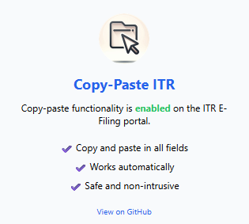

# Copy-Paste-ITR

    

Copy Paste ITR is an extension that enables copy, paste, and text selection functionality on the E-Filing portal of Income Tax Return (ITR) systems, where such actions are often restricted or disabled by default. The extension requires no additional configuration and is plug-and-play. Only works on `*.incometax.gov.in` websites; therefore, it does not interfere with other websites' copy and paste functionalities, such as Gmail, WhatsApp, Facebook, etc., when opened in the same browser.

---

    

## Features

- **Enables copy, paste, and select:** Removes restrictions on copying, pasting, and selecting text in all fields.
- **Automatic:** Works instantly on all pages under `*.incometax.gov.in`.
- **Non-intrusive:** Does not modify sensitive data or interfere with the portal's core functionality.
- **No other site is affected:** works only on `*.incometax.gov.in` therefore, does not affect the working of other websites copy-paste functionality such as Whatsapp,Gmail, Facebook, etc.

## Installation

1. **Clone or Download** this repository.
2. Go to `chrome://extensions/` in your browser.
3. Enable **Developer mode** (top right).
4. Click **Load unpacked** and select the project folder.
5. The extension icon will appear in your browser.

---

## Usage

- Visit any page on `*.incometax.gov.in`.
- Copy, paste, and select text as usual—even in fields where it was previously blocked.
- Click the extension icon to see the popup status.

---

## License

MIT License

---

**Enjoy hassle-free copy-pasting on the ITR E-Filing portal!**
